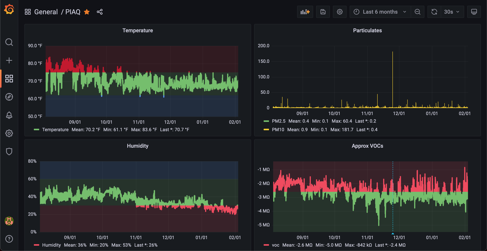

# Raspberry Pi Air Quality



## Hardware Requirements

- Raspberry Pi 4

- BME680 - Temperature, Pressure, Humidity, Gasses

- SDS011 - Particulates (PM2.5, PM10)

- LTR-559 - Light, Proximty (optional)

- SH1106 - OLED Display (optional)

## First-Time Pi Setup

1. Flash Ubuntu 20 LTS 64-bit [onto SD card](https://www.raspberrypi.org/downloads/).

2. Re-insert card into machine, edit `system-boot/network-config` file with wifi info.

3. `touch /Volumes/system-boot/ssh` to enable SSH.

4. Eject volume. Plug SD card into Pi and boot.

5. `ssh ubuntu@$IP`, (pw: `ubuntu`), change password.

6. On host machine: `./sync.sh`, on pi: `sudo ./setup.sh` (install updates and docker).

## Development

```sh
# install docker: https://docs.docker.com/get-docker/

# install rust
curl --proto '=https' --tlsv1.2 -sSf https://sh.rustup.rs | sh

# install cross for cross-compilation (requires docker)
cargo install cross

# compile locally, sync to pi, and run
./run.sh
```
